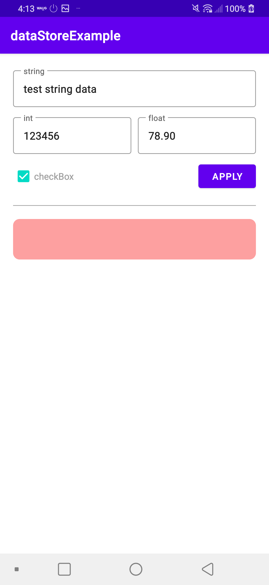
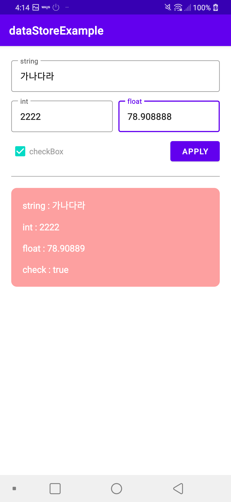
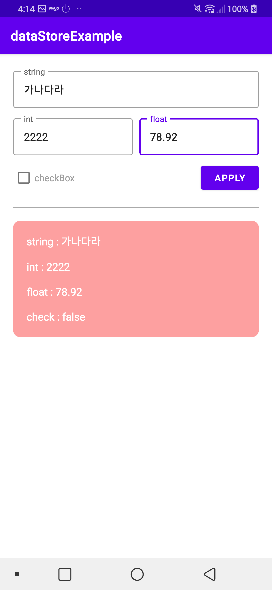

Datastore Example
====================
JetPack Datastore : 프로토콜 버퍼를 사용하여 키-값 쌍 또는 유형이 지정된 객체를 저장할 수 있는 데이터 저장소 솔루션입니다.
프로토콜 버퍼는 구조화된 데이터를 직렬화하기 위한 Google의 언어 중립적, 플랫폼 중립적, 확장 가능한 메커니즘이다.
 
XML을 생각할 수 있지만 더 작고 빠르고 간단. 데이터를 구조화하는 방법을 한 번 정의한 다음 특수 생성 소스 코드를 사용하여

다양한 데이터 스트림과 다양한 언어를 사용하여 구조화된 데이터를 쉽게 쓰고 읽을 수 있습니다.

Coroutine Flow

Introduction
------------

Getting Started
---------------

Screenshots
-----------

Support
-------

- Stack Overflow:
  - https://developer.android.com/topic/libraries/architecture/datastore
  - https://developer.android.com/kotlin/flow?hl=ko

